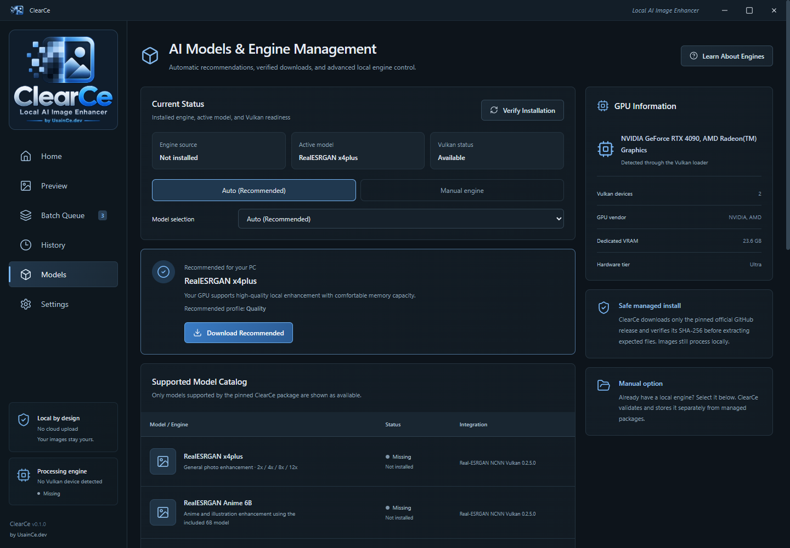
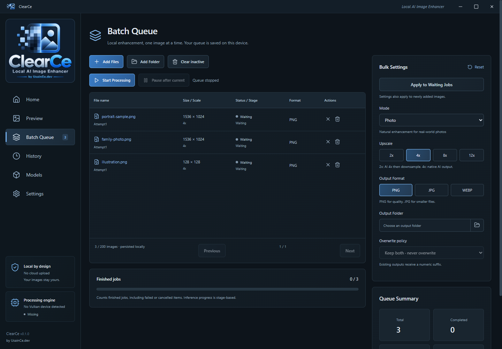

# ClearCe screenshots

Captured directly from the packaged Windows Tauri/WebView2 application. Public captures use a clean QA profile without personal paths or real job history; UI text was not painted over afterward.

The Home sample is explicitly labeled as a demonstration comparison. The queue contains local QA copies with generic filenames and was not processed.

## Main enhancement workspace — English

## Managed engine setup — English

## Batch queue — English

## Settings — Türkçe

The approved source logo is `public/brand/clearce-logo-source.png`. Display and icon assets are crops/resizes of the supplied image, without a generated replacement design.
